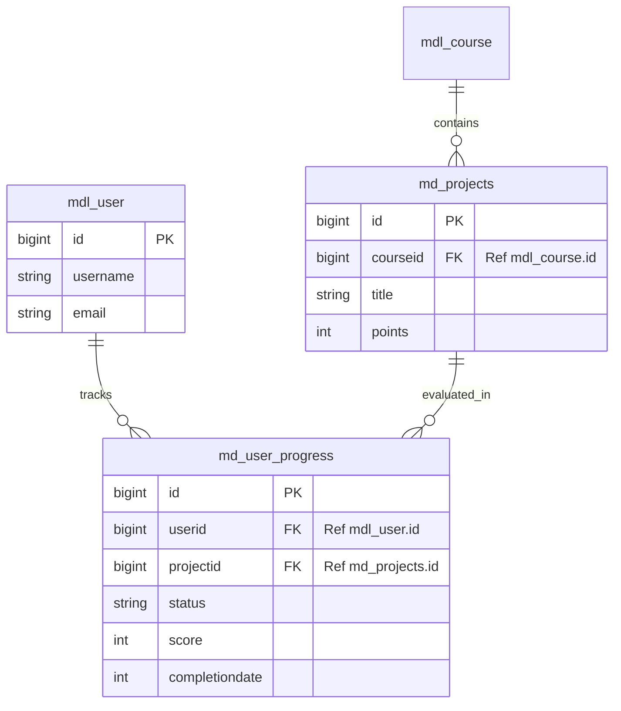

# Social Impact Plugin Design

## 1. Folder Structure

The plugin will be a local plugin located at `local/socialimpact/`.

```
local/socialimpact/
├── db/
│   ├── install.xml          # XMLDB schema definition
│   ├── services.php         # External API service definitions
│   └── upgrade.php          # Upgrade logic
├── lang/
│   └── en/
│       └── local_socialimpact.php  # Language strings
├── classes/
│   ├── api/                 # Internal API logic
│   │   ├── progress.php
│   │   └── project.php
│   └── external/            # External API (Web Service) implementation
│       ├── get_progress.php
│       └── submit_project.php
├── templates/               # Mustache templates for UI
│   └── dashboard.mustache
├── version.php              # Plugin version and dependencies
└── settings.php             # Admin settings
```

## 2. Database Design

### Tables

We will use the prefix `md_` for the plugin tables (in Moodle this effectively becomes `mdl_md_...` depending on the global prefix).

#### `md_user_progress`
Tracks the user's progress through social impact projects.

**SQL CREATE TABLE Statement:**

```sql
CREATE TABLE md_user_progress (
    id BIGINT(10) NOT NULL AUTO_INCREMENT,
    userid BIGINT(10) NOT NULL,
    projectid BIGINT(10) NOT NULL,
    status VARCHAR(20) NOT NULL DEFAULT 'started', -- 'started', 'completed', 'verified'
    score INT(3) DEFAULT 0,
    completiondate BIGINT(10),
    timecreated BIGINT(10) NOT NULL,
    timemodified BIGINT(10) NOT NULL,
    CONSTRAINT PRIMARY KEY (id)
);
CREATE INDEX md_user_prog_use_ix ON md_user_progress (userid);
CREATE INDEX md_user_prog_pro_ix ON md_user_progress (projectid);
```

#### `md_projects`
Stores metadata about the social impact projects available to users.

**SQL CREATE TABLE Statement:**

```sql
CREATE TABLE md_projects (
    id BIGINT(10) NOT NULL AUTO_INCREMENT,
    courseid BIGINT(10) NOT NULL, -- Link to a Moodle course
    title VARCHAR(255) NOT NULL,
    description TEXT,
    points INT(10) DEFAULT 100,
    timecreated BIGINT(10) NOT NULL,
    timemodified BIGINT(10) NOT NULL,
    CONSTRAINT PRIMARY KEY (id)
);
CREATE INDEX md_proj_cou_ix ON md_projects (courseid);
```

## 3. REST API Endpoints

The API will expose the following endpoints for the mobile app and frontend.

| Method | Endpoint | Description | Payload | Response |
| :--- | :--- | :--- | :--- | :--- |
| `GET` | `/socialimpact/user/{id}/progress` | Get progress for a specific user | N/A | JSON list of progress items |
| `POST` | `/socialimpact/progress` | Update/Record user progress | JSON keys: `userid`, `projectid`, `status` | JSON success/failure status |
| `GET` | `/socialimpact/projects` | List available projects | N/A | JSON list of projects |

### OpenAPI Specification (Excerpt)

```yaml
openapi: 3.0.0
info:
  title: Social Impact Plugin API
  version: 1.0.0
paths:
  /socialimpact/user/{id}/progress:
    get:
      summary: Get user progress
      parameters:
        - name: id
          in: path
          required: true
          schema:
            type: integer
      responses:
        '200':
          description: User progress data
          content:
            application/json:
              schema:
                type: array
                items:
                  $ref: '#/components/schemas/Progress'
  
  /socialimpact/progress:
    post:
      summary: Update user progress
      requestBody:
        required: true
        content:
          application/json:
            schema:
              type: object
              properties:
                userid:
                  type: integer
                projectid:
                  type: integer
                status:
                  type: string
                  enum: [started, completed, verified]
      responses:
        '200':
          description: Progress updated successfully
          content:
            application/json:
              schema:
                type: object
                properties:
                  success:
                    type: boolean
                  message:
                    type: string

components:
  schemas:
    Progress:
      type: object
      properties:
        id:
          type: integer
        userid:
          type: integer
        projectid:
          type: integer
        project_title:
          type: string
        status:
          type: string
        score:
          type: integer
        timecreated:
          type: integer
```

## 4. Entity Relationship Diagram (ERD)


