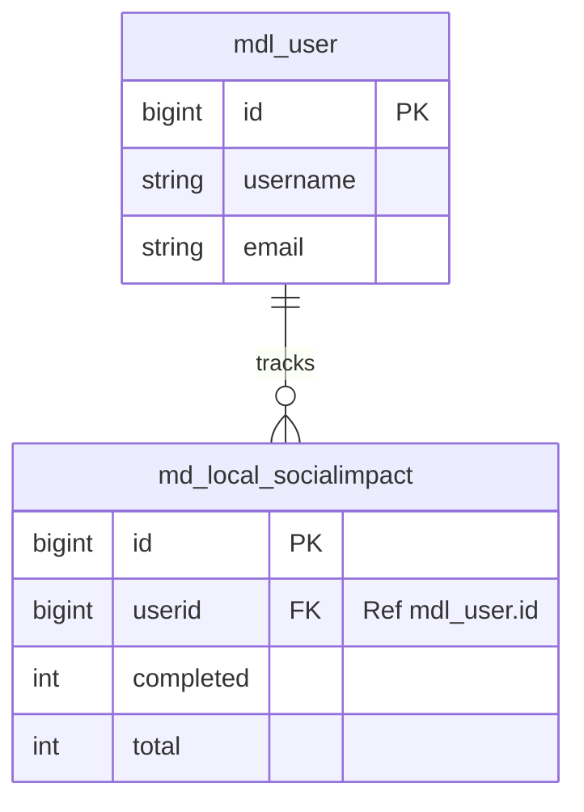

# Social Impact Plugin Design

## 1. Folder Structure

The plugin will be a local plugin located at `local/socialimpact/`.

```
local/socialimpact/
├── db/
│   ├── install.xml          # XMLDB schema definition
│   ├── services.php         # External API service definitions
├── lang/
│   └── en/
│       └── local_socialimpact.php  # Language strings
├── lib.php
├── externallib.php          # External API service
├── version.php              # Plugin version and dependencies
└── settings.php             # Admin settings
```

## 2. Database Design

### Tables

We will use the prefix `md_` for the plugin tables (in Moodle this effectively becomes `md_...` depending on the global prefix).

#### `md_local_socialimpact`

Tracks the user's progress through social impact projects.

**SQL CREATE TABLE Statement:**

```sql
CREATE TABLE md_local_socialimpact (
    id BIGINT(10) NOT NULL AUTO_INCREMENT,
    userid BIGINT(10) NOT NULL,
    completed INT(10) NOT NULL DEFAULT 0,
    total INT(10) DEFAULT 0,
    timecreated BIGINT(10) NOT NULL,
    timemodified BIGINT(10) NOT NULL,
    CONSTRAINT PRIMARY KEY (id)
);
CREATE INDEX md_simp_user_ix ON md_local_socialimpact (userid);
```

## 3. REST API Endpoints

The API will expose the following endpoints for the mobile app and frontend.

| Method | Endpoint                      | Description                      | Payload                                                       | Response                    |
| :----- | :---------------------------- | :------------------------------- | :------------------------------------------------------------ | :-------------------------- |
| `GET`  | `/webservice/rest/server.php` | Get progress for a specific user | params: `wstoken`, `wsfunction`, `moodlerestformat`, `userid` | JSON list of progress items |
| `POST` | `/webservice/rest/server.php` | Update/Record user progress      | JSON keys: `userid`, `completed`, `total` params: #ref GET,   | JSON success/failure status |

### OpenAPI Specification (Excerpt)

```yaml
openapi: 3.0.0
info:
  title: Social Impact Plugin API
  version: 1.0.0
paths:
  /webservice/rest/server.php:
    get:
      summary: Get user progress
      parameters:
        - wstoken: string
          in: path
          required: true
          schema:
            type: string
        - wsfunction: string
          in: path
          required: true
          schema:
            type: string
        - moodlerestformat: string
          in: path
          required: false
          schema:
            type: string
        - userid: integer
          in: path
          required: true
          schema:
            type: integer
      responses:
        "200":
          description: User progress data
          content:
            application/json:
              schema:
                type: object
                properties:
                  completed:
                    type: integer
                  total:
                    type: integer
      post:
        summary: Set user progress
        parameters:
          - wstoken: string
            in: path
            required: true
            schema:
              type: string
          - wsfunction: string
            in: path
            required: true
            schema:
              type: string
          - moodlerestformat: string
            in: path
            required: false
            schema:
              type: string
          - userid: integer
            in: path
            required: true
            schema:
              type: integer
        requestBody:
          required: true
          contant:
            application/json:
              schema:
                type: object
                properties:
                  completed:
                    type: integer
                  total:
                    type: integer
          responses:
            "200":
              description: Progress has been set successfully
              content:
                application/json:
                  schema:
                    type: object
                    properties:
                      success:
                        type: boolean
                      completed:
                        type: integer
                      total:
                        type: integer
```

## 4. Entity Relationship Diagram (ERD)


